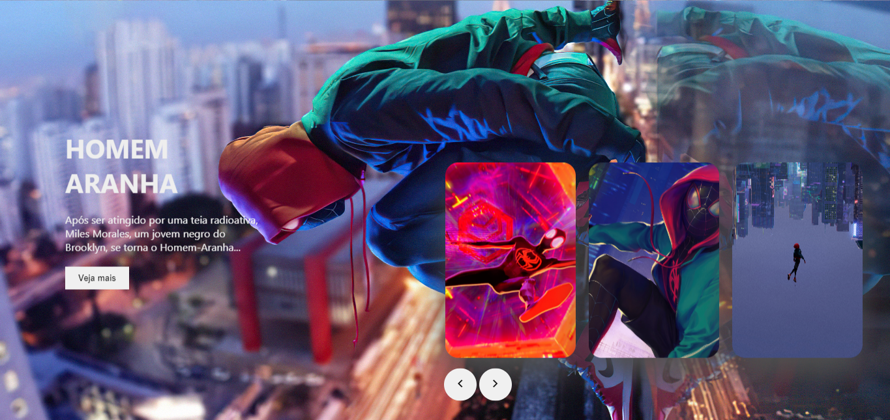

<h1>Homem Aranha no Aranhaverso</h1>

  Esta é uma tela feita com HTML, CSS e JavaScript na qual fiz durante um curso a um tempo e resolvi refazer a fim de revisar o conteúdo de CSS.
  Com o JavaScript eu fiz a interação do botão, para que haja a mudança entre uma foto e outra (slide).

